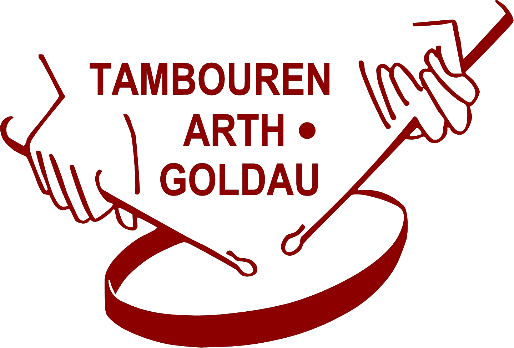

[tambourenarthgoldau.ch](https://tambourenarthgoldau.ch)

---

## 🚀 Development

### Run Hugo Server

```bash
# Start development server
hugo server

# Include drafts
hugo server -D

# Website opens at: http://localhost:1313
```

## ✍️ Adding New Posts

### Using Page Bundles

Page Bundles allow you to organize content and related images in a single folder:

```bash
# Create new Page Bundle
hugo new posts/$(date -u +%Y-%m-%d)-my-new-post/index.md
```

