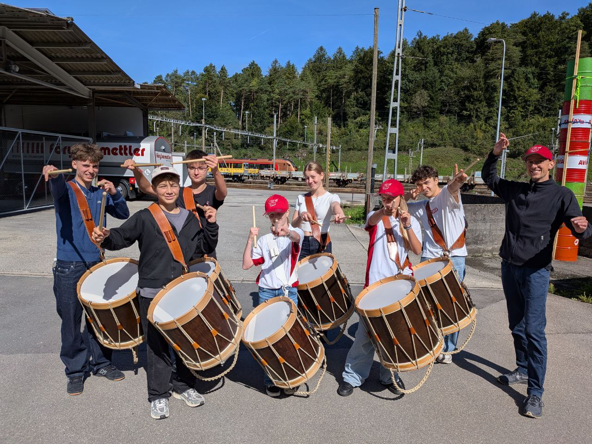

+++
date = '2025-09-17T23:17:57+02:00'
draft = false
title = 'Tambourenverein Arth-Goldau bereitet sich für die eidgenössischen Wettspiele in Lenzburg vor'
featured_image = '/posts/2025-09-17-vorbereitung-lenzburg-25/vorbereitung-lenzburg.png'
+++

# Tambourenverein Arth-Goldau bereitet sich für die eidgenössischen Wettspiele in Lenzburg vor

*Die Jungtambourensektion des Tambourenvereins Arth-Goldau bei der Vorbereitung für das Eigenössische Jungtambouren- und Pfeiferfest in Lenzburg*

Schon seit Wochen bereiten sich die Jungtambouren des Tambourenvereins Arth-Goldau fleissig auf das kommende eidgenössische Jungtambouren- und Pfeiferfest in Lenzburg vor.
Da es sich erst um die dritte Austragung dieses Festes handelt, ist die Vorfreude besonders gross.

Das Festwochenende findet vom 19. bis zum 21. September 2025 statt. Es beginnt am Freitag mit den Einzelwettspielen,
bei denen die Tambouren vor einer fachkundigen Jury ihr Können unter Beweis stellen und sich mit Gleichaltrigen aus der ganzen Schweiz messen.
Am Abend bestreiten die Besten jeder Kategorie das jeweilige Finale.

Am Samstag stehen die Gruppenwettspiele auf dem Programm. Die sieben Sektionswettspieler treten in der dritthöchsten Stärkekategorie unter der Leitung von Benj Fassbind an.
Interessierte können die Wettspiele direkt in Lenzburg besuchen und die Tambourenvereine live vor Ort miterleben.
Zum Abschluss des Wochenendes werden die Jungtambouren am Sonntag, den 21. September, um ca. 17:00 Uhr wieder im
Restaurant Schöntal in Oberarth einziehen. Angehörige und Freunde sind eingeladen, die jungen Musiker dort zu empfangen.
