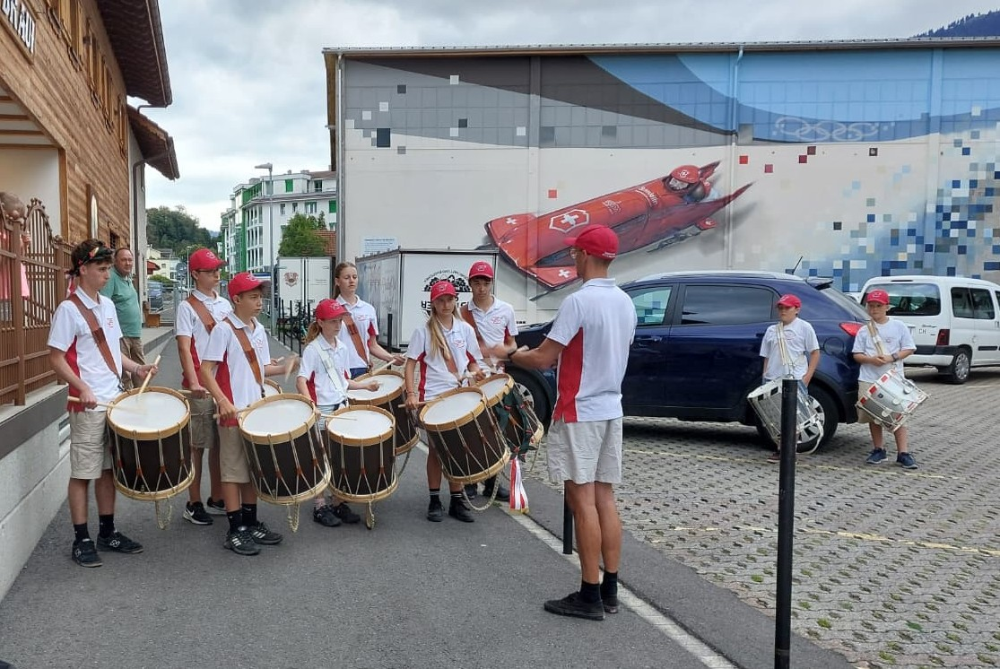

+++
date = '2025-09-22T09:21:37+02:00'
draft = false
title = 'Eidgenössisches Jungtambouren- und Pfeiferfest in Lenzburg 2025'
featured_image = '/posts/2025-09-22-lenzburg-25/lenzburg25.jpg'
+++

# Eidgenössisches Jungtambouren- und Pfeiferfest in Lenzburg 2025

*Tambourenverein Arth-Goldau beim Einzug in Oberarth nach dem  Eidgenössischen Jungtambouren- und Pfeiferfest in Lenzburg*

Am Freitagmorgen machten sich die Jungtambouren des Tambourenvereins Arth-Goldau auf den Weg nach Lenzburg zum Eidgenössischen Jungtambouren- und Pfeiferfest. Die Vorfreude war gross – ein eidgenössisches Fest ist immer etwas Besonderes. Schon früh begannen die Einzelwettspiele, bei denen die jungen Tambouren ihr Können vor einer fachkundigen Jury unter Beweis stellen mussten. Für einige war es der erste Start an einem so bedeutenden Anlass, und entsprechend war die Nervosität spürbar. Trotzdem meisterten alle ihre Auftritte mit Bravour.

Besonders hervorzuheben ist Timo Windlin, der sich in der Vorrunde A der zweithöchsten Stärkekategorie den 4. Rang sichern konnte und sich so für das Finale der Kategorie T2J qualifizierte. Dort schlug er sich ebenfalls hervorragend und erreichte den 15. Rang. Timon Lischer verpasste in der Kategorie T3JB mit nur einem Zehntel Rückstand den Kranz – eine starke Leistung! Valentina Stamerra (T3JA) und Nina Gisler (T4JA) verpassten den Kranz ebenfalls nur knapp. Die übrigen Teilnehmenden platzierten sich im guten Mittelfeld und sammelten wertvolle Wettkampferfahrung.

Am Samstag folgten die Gruppenwettspiele. Unter der Leitung von Benj Fassbind trat die Sektion in der Kategorie S3J gegen starke Konkurrenz aus der ganzen Schweiz an und erreichte den 9. Rang von insgesamt 37 teilnehmenden Vereinen – ein solides Resultat auf eidgenössischer Bühne. Nach dem Umzug und der Rangverkündigung genossen alle einen stimmungsvollen Abend im Festzelt.

Am Sonntag nach dem Festumzug kehrte die Delegation nach Oberarth zurück, wo Eltern und Freunde sie im Restaurant Schöntal herzlich empfingen. Die Freude über die gelungenen Auftritte war gross, und man liess das ereignisreiche Wochenende gemütlich ausklingen.

*Jungtambouren der Tambourenvereine Schwyz, Steinen und Arth-Goldau*

Die Rangliste und Jurybericht von Lenzburg 2025 ist hier verfügbar:

- [Rangliste Lenzburg 2025 (PDF)](https://lenzburg2025.ch/fileadmin/Rangliste/2025-09-20_rangliste_v1.0.pdf)
- [Jurybericht Lenzburg 2025 (PDF)](https://lenzburg2025.ch/fileadmin/Rangliste/2025-09-20_jurybericht_v1.0.pdf)
