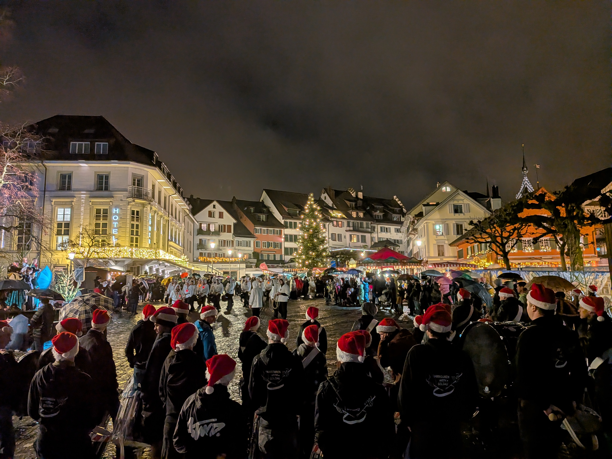

+++
date = '2025-12-07T19:58:51+01:00'
draft = false
title = 'Klausenumzug & Märlisunntig'
featured_image = '/posts/2025-12-07-klausenumzug-und-maerlisunntig/maerlisunntig.jpg'
+++

# Klausenumzug & Märlisunntig

*Der Klausenumzug in Arth mit den Jungtambouren des Tambourenvereins Arth-Goldau*

Anfang Dezember kommen die Tambouaren so richtig in Weihnachtsstimmung.
Am 6. Dezember nehmen wir traditionell am Klausenumzug in Arth teil.
Mit dem "Chlausemarsch" und weihnachtlicher Stimmung begleiten wir den Samichlaus
und seine Helfer durch die Strassen von Arth.
Die neuen Jungtambouren durften dabei ihren ersten Auftritt vor Publikum
absolvieren und meisterten die Herausforderung mit Bravour.
Die Leuchtschlegel sorgen dabei immer wieder für staunende Blicke bei den Zuschauern.

Am 7. Dezember werden in der Zuger Altstadt Märli erzählt. Zusammen mit den Tambouren Baar-Hünenberg
und den Tambouren der Jugendmusik Zürich, begleiten wir den Märlisunntig musikalisch.

*Der Märlisunntig in Zug mit den Tambouren Baar-Hünenberg und der Jugendmusik Zürich*
