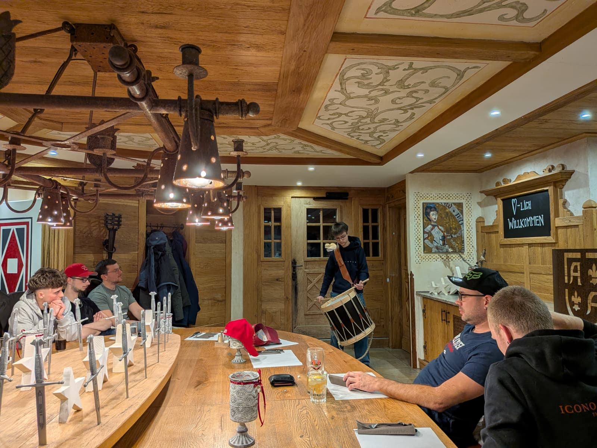

+++
date = '2025-12-23T10:02:33+01:00'
draft = false
title = 'Ein neues Aktivmitglied und Vorfreude auf das Schnapszahl-Jubiläum'
featured_image = '/posts/2025-12-16-33-generalversammlung/aufnahme-ruben.jpeg'

+++

# Ein neues Aktivmitglied und Vorfreude auf das Schnapszahl-Jubiläum

**Zur 33. Generalversammlung trafen sich die Mitglieder des Tambourenvereins Arth-Goldau in der Horseshoe Brauerei in Oberarth. Neben dem Rückblick auf ein ereignisreiches Vereinsjahr standen die Aufnahme eines Neumitglieds und der Ausblick auf das kommende Jubiläumsfest im Zentrum.**

*Ruben Herger wurde als Aktivmitglied in den Tambourenverein aufgenommen*

Präsident Kuno Bürgi liess in seinem Jahresbericht das vergangene Jahr Revue passieren. Ein absolutes Highlight und viel besprochenes Thema war die Neuuniformierung: Zum ersten Mal trat der Verein in seiner neuen Galauniform auf, was bei den Zuschauern für staunende Blicke sorgte. Auch die vielen Auftritte und Vereinsausflüge blieben in bester Erinnerung.

Auch musikalisch konnte der Technische Leiter Philipp Gisler auf ein erfolgreiches Jahr zurückblicken. Besonders der Nachwuchs zeigte sein Können: Am eidgenössischen Jungtambourenfest in Lenzburg holte sich Timo Windlin einen Kranz und erreichte das Finale. Auch die Aktivmitglieder Sven Truttmann und Marco Fässler konnten sich in Langenthal Kränze sichern.

Bei den Wahlen wurden Philipp Gisler (Technischer Leiter), Julian Betschart (Kassier und Vizepräsident) sowie Flavian Ketterer (Rechnungsrevisor) einstimmig und mit Applaus für zwei weitere Jahre in ihren Ämtern bestätigt.

Einen besonders erfreulichen Moment gab es bei den Mutationen: Mit Ruben Herger konnte ein junger Tambour, der sich bereits bestens in den Verein integriert hat, als Aktivmitglied aufgenommen werden. Er bewies sein Können, indem er der Versammlung den Marsch «Arther» vorspielte, und wurde unter grossem Applaus aufgenommen. Zudem startet Anna-Sophia Mettler neu in das Probejahr. Der Verein zählt nun, inklusive der Musikschüler, stolze 35 Trommlerinnen und Trommler.

Zum Schluss richtete sich der Blick in die Zukunft. Der Verein plant ein Jubiläumsfest: Am 24. Oktober 2026 wird das 33-jährige Jubiläum im Georgsheim in Arth gefeiert. Geplant ist eine Show rund um die Zahl 33 sowie Unterhaltung mit der Gastformation «BodeständiX».

Nach dem offiziellen Teil liessen die Tambouren den Abend in gemütlicher Runde ausklingen.

