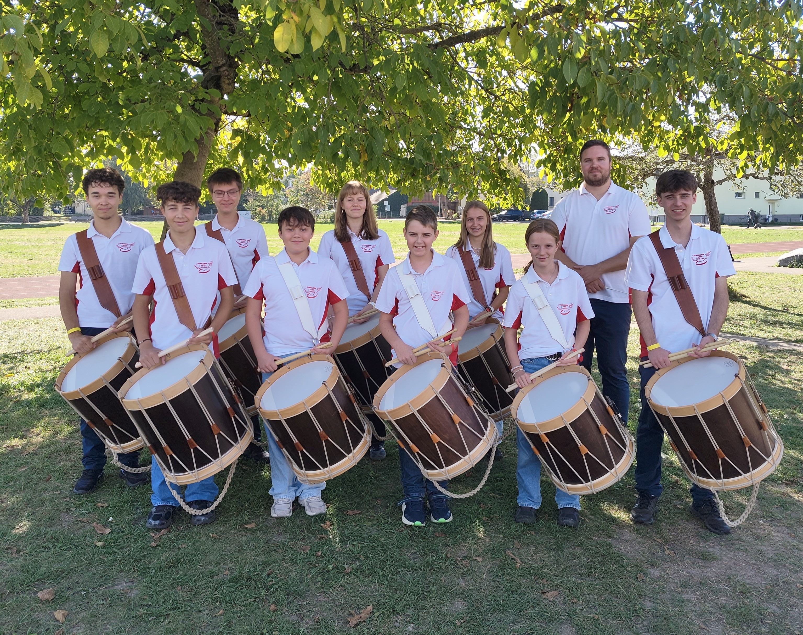

+++
date = '2026-10-01T11:00:00+02:00'
draft = false
title = 'Erfolgreiches Wochenende für den Tambourenverein Arth-Goldau am Zentralschweizerischen in Biberist'
featured_image = '/posts/2026-10-01-biberist-26/biberist26.jpg'
+++

# Erfolgreiches Wochenende für den Tambourenverein Arth-Goldau am Zentralschweizerischen in Biberist

*Die Jungtambouren des Tambourenvereins Arth-Goldau am Zentralschweizerischen Jungtambouren- und -pfeiferfest in Biberist*

Am vergangenen Wochenende machten sich die Jungtambouren des Tambourenvereins Arth-Goldau auf den Weg an das 41. Zentralschweizerische Jungtambouren- und -pfeiferfest (ZJTPF) in Biberist. Die Vorfreude war gross, schliesslich ist ein solches Wettspiel immer ein besonderes Highlight im Vereinsjahr.

Bei den Einzelwettspielen mussten die jungen Tambouren ihr Können vor einer fachkundigen Jury unter Beweis stellen. In der anspruchsvollen höchsten Kategorie T1 erreichte Timo Windlin den 29. Rang, dicht gefolgt von Janis Lischer auf dem 39. Rang. Auch in den T2-Kategorien konnten gute Resultate erzielt werden: Timon Lischer erreichte in der Vorrunde C den 21. Rang. Anna-Sophia Mettler klassierte sich in der Vorrunde B auf dem 24. Rang und Ruben Herger schloss die Vorrunde A auf dem 31. Rang ab. Die übrigen Teilnehmenden des Vereins zeigten in den Kategorien T3 bis T5 ebenfalls tolle Leistungen, platzierten sich im Mittelfeld und sammelten wertvolle Wettkampferfahrung auf Verbandsebene.

Am Sonntagmorgen standen die Sektionswettspiele an. Unter der Leitung von Philipp Gisler traten die Jungtambouren in der Kategorie S3 gegen starke Konkurrenz aus der ganzen Zentralschweiz und angrenzenden Regionen an. Die Gruppe zeigte einen überzeugenden Auftritt und erreichte den hervorragenden 6. Rang von insgesamt 21 teilnehmenden Vereinen – ein mehr als solides Resultat! Die Freude über die gelungenen Auftritte war gross, und das ereignisreiche Wochenende konnte gebührend gefeiert werden.

## 33-Jahre-Jubiläum im Oktober

Wer die Jungtambouren und Tambouren live in Aktion sehen und mit dem Verein anstossen möchte, hat bald eine tolle Gelegenheit dazu: Am Samstag, 24. Oktober 2026, feiert der Tambourenverein Arth-Goldau sein 33-Jahre-Jubiläum im Georgsheim in Arth. Angehörige, Freunde und Interessierte sind herzlich eingeladen.

Weitere Informationen zum Jubiläum finden Sie hier auf der Webseite, Tickets sind in Kürze erhältlich.

## Alle Resultate des Tambourenvereins Arth-Goldau im Überblick

**Sektionswettspiel:**

- Kategorie S3: 6. TV Arth-Goldau (78.80 Punkte)

**Einzelwettspiele:**

- Kategorie T1: 29. Timo Windlin (85.10); 39. Janis Lischer (81.15)
- Kategorie T2A: 31. Ruben Herger (78.65)
- Kategorie T2B: 24. Anna-Sophia Mettler (78.60)
- Kategorie T2C: 21. Timon Lischer (85.20)
- Kategorie T3A: 17. Valentina Stamerra (84.90); 40. Maximilian Fano (74.25)
- Kategorie T3B: 37. Nina Gisler (77.50)
- Kategorie T4A: 34. Elias Imbach (72.10)
- Kategorie T4B: 30. Joel Andermatt (70.90)
- Kategorie T5: 15. Vitus Reichlin (78.50); 41. Yoan Abegg (73.95); 44. Leo Flück (69.45); 46. Louis Van der Brule (65.75)
